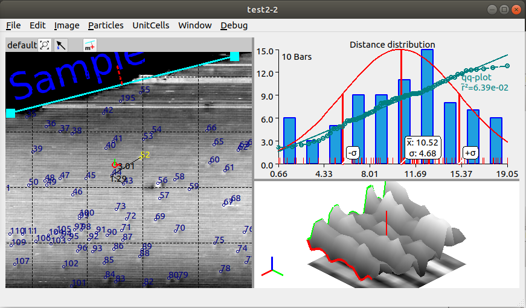

## ImgDist
*ImgDist* is a program designed to detect and analyze images containing microscopic particles. Or in more general terms: measure distances and unitcells pictured on a image. 

*ImgDist* is developed on Ubuntu 18.04 LTS. For now this GitHub only contains Windows binary in the 'windows' sub-directory.

The screenshot above shows the mainwindow in *distance* mode, i.e. when particles is detected. The large left pane shows the image and the detected particles. The distances is measured from the *measureline* - the cyan line perpendicular to the particle of interest. The actual length of the measureline is irrelevant, it is the distance parrallel to the red stippled line that matters.

The upper right pane shows the distribution af distances, the calculated mean value and standard deviation for a *Normal distribution*. The red curve is the teoretical distribution. The dark cyan line and points is the qq-plot (measuring haw well the data fit to a Normal distribution).

The lower right pane shows a 3d representation of the image in a small area around either the selected particle of the *3d cursor* (the small circle with a indication of a red x-axis and a green y-axis - near the middle of the image).

[User Guide](indeks.md)
